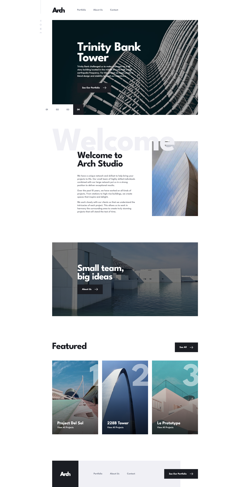

# Frontend Mentor - Arch Studio multi-page website solution

This is a solution to the [Arch Studio multi-page website challenge on Frontend Mentor](https://www.frontendmentor.io/challenges/arch-studio-multipage-website-wNIbOFYR6). Frontend Mentor challenges help you improve your coding skills by building realistic projects.

## Overview

### The challenge

Users should be able to:

-   View the optimal layout for each page depending on their device's screen size
-   See hover states for all interactive elements throughout the site
-   Receive an error message when the contact form is submitted if:
    -   The `Name`, `Email` or `Message` fields are empty should show "Can't be empty"
    -   The `Email` is not formatted correctly should show "Please use a valid email address"
-   **Bonus**: View actual locations on the contact page map. The addresses we have on the design are fictional, so you'll need to add real addresses for this bonus task.

### Screenshot

### Links

-   Solution URL: [GitHub](https://github.com/MarcinFiuk/arch-studio-multi-page-website)
-   Live Site URL: [Vercel](https://arch-studio-git-dev-marcinfiuk.vercel.app/)

## My process

### Built with

-   Semantic HTML5 markup
-   CSS custom properties
-   Flexbox and CSS Grid
-   [React](https://reactjs.org/) - JS library
-   [React Router](https://reactrouter.com/) - React framework
-   [Styled Components](https://styled-components.com/) - For styles
-   [React Leaflet](https://react-leaflet.js.org/)

## Author

-   Frontend Mentor - [@MarcinFiuk](https://www.frontendmentor.io/profile/MarcinFiuk)
-   Linkedin - [Marcin Fiuk](https://www.linkedin.com/in/marcin-fiuk-0b498b241/)
